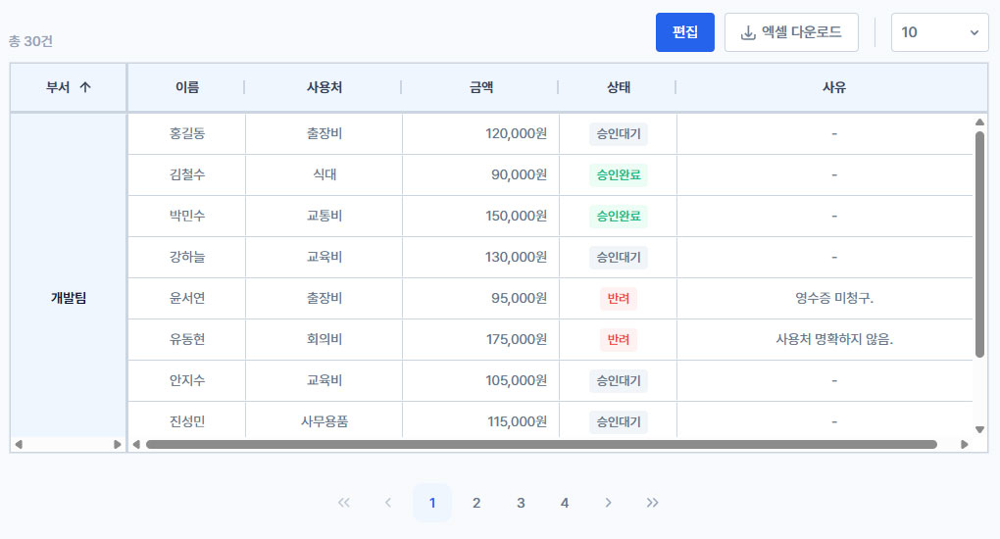
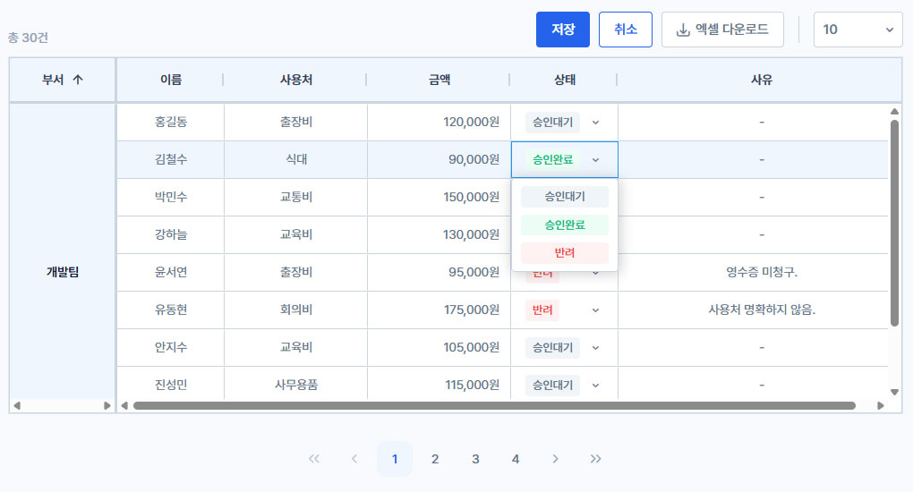
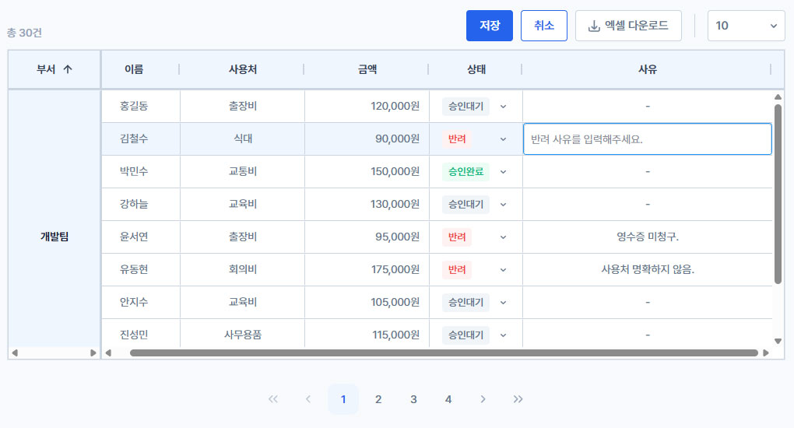
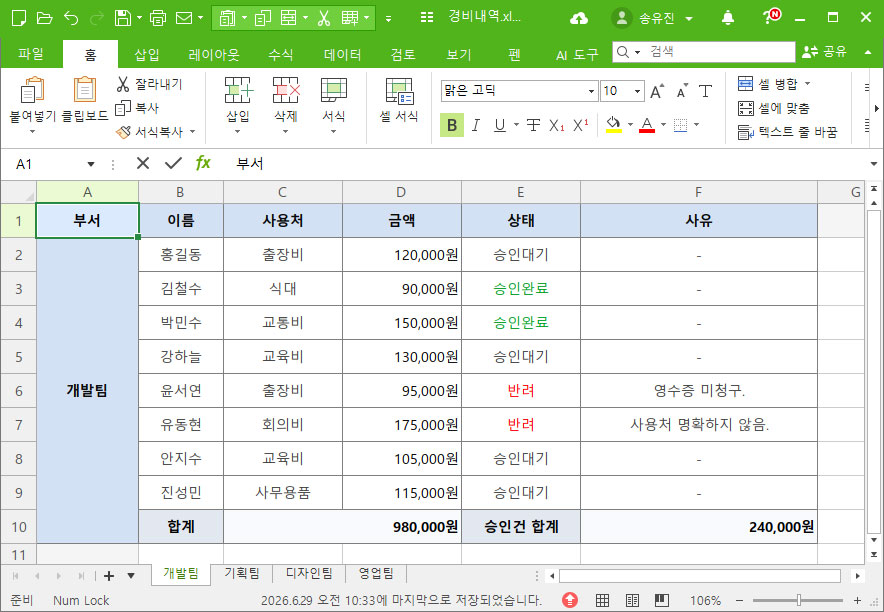

# 📊 AG Grid 경비 관리

부서별 경비 내역을 AG Grid로 조회·편집·다운로드할 수 있는 React 프로젝트입니다.

---

## 🛠️ 기술 스택

- React 19
- AG Grid Community 35 (ag-grid-react)
- Vite 8
- ExcelJS
- React Router

---

## 🚀 시작하기

### 사전 준비

- Node.js 20 이상
- npm

### 설치 및 실행

```bash
npm install
npm run dev
```

브라우저에서 `http://localhost:5173` 접속

### 빌드

```bash
npm run build
npm run preview
```

---

## 📷 화면

### 조회 모드

상태 뱃지, 부서별 세로 병합, 페이지네이션



### 편집 모드 — 상태 변경

커스텀 뱃지 드롭다운, 저장 / 취소



### 편집 모드 — 반려 사유 입력

반려 선택 시 사유 input 자동 focus, placeholder 표시



### 엑셀 다운로드

부서별 시트, 합계 행·상태 색상·셀 병합 반영



---

## ✨ 주요 기능

### 그리드 기본

- 📋 AG Grid 연동 (`rowData`, `columnDefs`, `enableCellSpan`)
- 🏢 부서별 `spanRows` 세로 병합
- ➕ 부서별 합계 행 삽입 (`addDepartmentSubtotals` / `isSummary`)
- ↔️ 합계 행 가로 병합 (`colSpan` + `valueGetter` / `valueFormatter`)
- 🔢 부서 1차 정렬 + 열 2차 정렬 (부서 그룹 내)
- 📌 합계 행 부서 그룹 맨 아래 고정 (`postSortRows`)
- 📄 커스텀 Pagination (합계 행 포함 페이지 계산)

### 편집

- ✏️ Draft 패턴 (`draftData` / `allData`, 편집 · 저장 · 취소)
- 🏷️ 상태 커스텀 뱃지 드롭다운 (`StatusCellEditor` / `StatusCellEditRenderer`)
- 📝 반려 시 사유 입력 (`ReasonCellEditor`, placeholder)
- 🎯 반려 선택 후 사유 셀 자동 focus
- ⚠️ 저장 시 반려 사유 필수 검증 alert
- ✅ 저장 confirm (`저장하시겠습니까?`)
- 🔍 검증 실패 시 해당 사유 셀로 focus 이동 (`scheduleReasonFocus`)

### 내보내기

- 📥 엑셀 다운로드 (`exportEmployeesExcel`) — 부서별 시트, 스타일·병합

---

## 📁 프로젝트 구조

```
src/
├── pages/
│   └── GridPage.jsx          # 데이터·편집·저장·페이지 state
├── components/
│   ├── Grid/
│   │   ├── EmployeeGrid.jsx  # columnDefs·편집·focus
│   │   ├── BasicGrid.jsx     # AG Grid 공통 래퍼
│   │   ├── StatusCellEditor.jsx
│   │   ├── StatusCellEditRenderer.jsx
│   │   ├── ReasonCellEditor.jsx
│   │   └── ...
│   └── Pagination/
├── data/
│   ├── rowData.json
│   └── employeeColDefs.js
└── utils/
    ├── sortEmployees.js
    ├── addDepartmentSubtotals.js
    ├── postSortSummaryLast.js
    └── exportEmployeesExcel.js
```

---

## 💡 구현 포인트

| 주제 | 설명 |
|------|------|
| Draft 패턴 | 셀 수정은 `draftData`에만 반영, **저장** 시 `allData` 확정, **취소** 시 폐기 |
| 커스텀 cellEditor | AG Grid v35 `value` / `onValueChange` API, 팝업 드롭다운 |
| 반려 사유 UX | 상태 → 반려 시 reason 초기화, 자동 focus, 저장 시 검증 |
| 그리드 ↔ React | `draftDataRef`로 `stopEditing` 직후 동기 검증, `scheduleReasonFocus` 재시도 |
